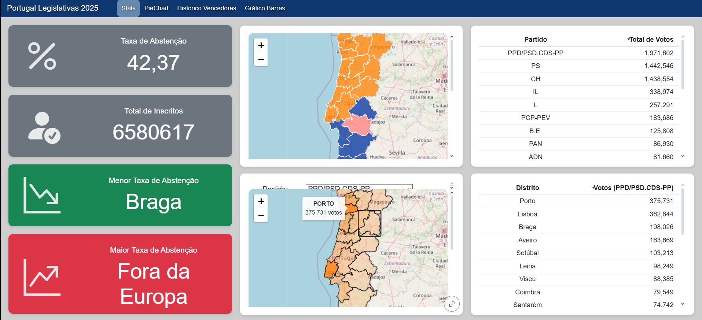

# Dashboard de Eleições Legislativas

Este projeto é um dashboard interativo para a visualização de dados eleitorais, desenvolvido com [Quarto](https://quarto.org/).



## Autores

- Simão Rodrigues
- Rodrigo Resa

## GitHub Pages

Este ZIP já está preparado para GitHub Pages. O ficheiro principal é `index.html`, por isso o GitHub Pages deixa de abrir apenas o `README.md`.

Para publicar:

1. Enviar todos os ficheiros desta pasta para o repositório.
2. No GitHub, ir a **Settings > Pages**.
3. Em **Build and deployment**, escolher **Deploy from a branch**.
4. Selecionar a branch `main` e a pasta `/root`.
5. Guardar e abrir o link gerado pelo GitHub Pages.

Nota: se voltares a renderizar o projeto com Quarto, usa `index.qmd` como ficheiro principal.

## Instruções de Execução

Para executar este projeto localmente, siga os passos abaixo:

1.  **Instalar o Quarto:** Se ainda não tiver o Quarto instalado, siga as instruções de instalação no [site oficial](https://quarto.org/docs/get-started/).

2.  **Clonar o Repositório:** Clone ou faça o download deste repositório para a sua máquina local.

3.  **Navegar para a Pasta:** Abra um terminal e navegue para a pasta do projeto.

4.  **Executar o Dashboard:** Corra o seguinte comando no terminal:
    ```bash
    quarto preview quarto.qmd
    ```
    Este comando irá processar o ficheiro, instalar as dependências necessárias (como pacotes de Python ou bibliotecas OJS) e abrir o dashboard no seu navegador.

**Nota:** Certifique-se de que a estrutura de ficheiros, especialmente a pasta com os ficheiros `legislativas1.json` e `ContinenteDistritos_geo.geojson`, é mantida como está.

## Funcionalidades Implementadas

O dashboard está organizado em várias secções interativas:

### 1. Estatísticas Gerais (Value Boxes)

- **Taxa de Abstenção:** Apresenta a média da taxa de abstenção em todos os distritos.
- **Total de Inscritos:** Mostra o número total de votos contados (votantes + brancos + nulos).
- **Menor e Maior Taxa de Abstenção:** Identifica os distritos com a menor e a maior taxa de abstenção, respetivamente.

### 2. Mapas Interativos (Leaflet)

- **Mapa 1 (Vencedores por Distrito):** Um mapa de Portugal onde cada distrito é colorido de acordo com o partido que obteve mais votos.
- **Mapa 2 (Votos por Partido):** Um mapa dinâmico onde o utilizador pode selecionar um partido num menu. Os distritos são então coloridos com uma intensidade que corresponde à percentagem de votos desse partido em cada distrito. Ao passar o rato sobre um distrito, é exibido o nome e o número exato de votos.

### 3. Tabelas de Dados

- **Votos por Partido:** Uma tabela que lista o total de votos para cada partido a nível nacional, ordenada de forma decrescente.
- **Votos por Distrito:** Uma tabela dinâmica que se atualiza com base no partido selecionado no **Mapa 2**, mostrando a contagem de votos para esse partido em cada distrito, ordenada do maior para o menor.

### 4. Gráfico Hierárquico (Pie Chart / Sunburst)

- Um gráfico "sunburst" interativo que mostra a distribuição de votos.
  - O anel interior representa os partidos políticos.
  - O anel exterior detalha a distribuição de votos de cada partido pelos diferentes distritos.
- É possível clicar num partido para fazer "zoom" e ver a sua distribuição em maior detalhe. O círculo central permite voltar à visualização inicial.
- Ao passar o rato, uma tooltip mostra a hierarquia (Partido > Distrito) e o número de votos.

### 5. Histórico de Vencedores (Mermaid)

- Dois fluxogramas simples que ilustram os vencedores das eleições legislativas portuguesas de 2002 a 2024.

### 6. Gráfico de Barras (Observable Plot)

- Um gráfico de barras que permite ao utilizador selecionar um partido e ver a distribuição de votos por distrito, ordenado do mais votado para o menos votado.
